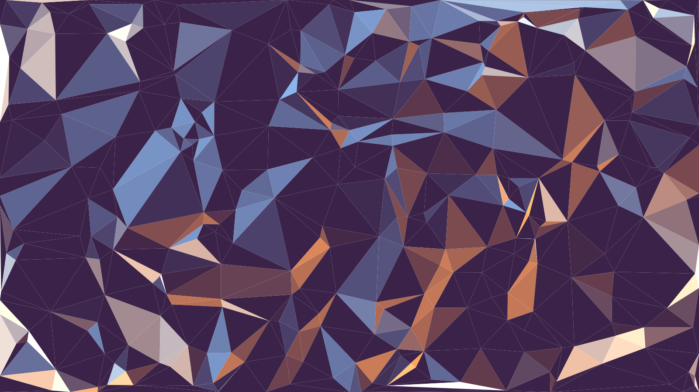

  <h1 style="color: white; font-size: 32px; text-shadow: 2px 2px 4px rgba(0,0,0,0.8); margin: 0;">
    Mi Título Sobre la Imagen
  </h1>

# Cerebro

Segundo Cerebro Obsidian

## Configuración

- **Navigator**: 
	- https://github.com/johansan/notebook-navigator 
	- https://www.youtube.com/watch?v=m2maDNtho7Y
- **Advanced Tables**: https://github.com/tgrosinger/advanced-tables-obsidian
- **Excalidraw** https://github.com/zsviczian/obsidian-excalidraw-plugin
- **Simple mind map**: https://github.com/wanglin2/obsidian-simplemindmap
- **Git Sync**: https://github.com/livan116/github-valut-sync
## Links

- **Cloud**: https://www.ovhcloud.com/es/
- **DNS**: https://www.namecheap.com/
- **Repositorio**: https://github.com/omargo33
- **Qapaq**: https://qapaq.site/
- **CheckFind**: https://www.checkfind.lat/
- **Diseno**: [38Sitios](https://www.reddit.com/r/webdev/comments/15x3eph/38_websites_you_can_use_for_cool_backgrounds/?tl=es-419)
- **Coolors.co**: https://coolors.co/
- **AWS**: https://aws.amazon.com/
- **JDK-25**: [Descarga](https://www.oracle.com/java/technologies/javase/jdk25-archive-downloads.html)
---
*2026-09-12* 
**#omargo33**
